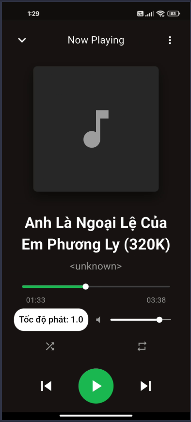
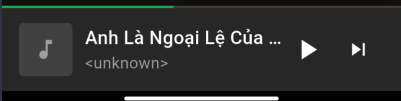
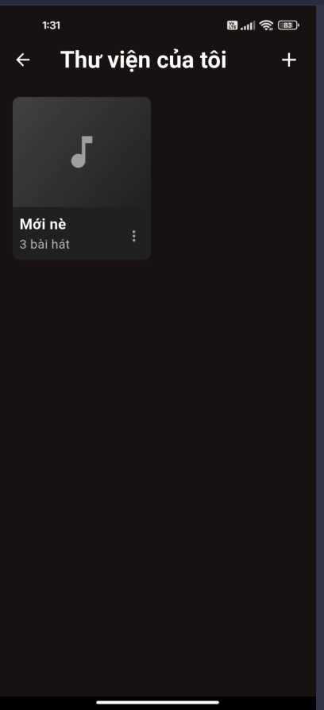
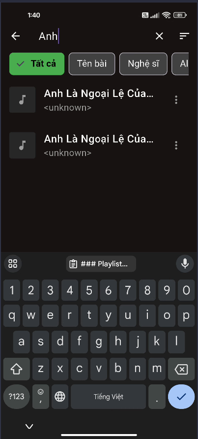
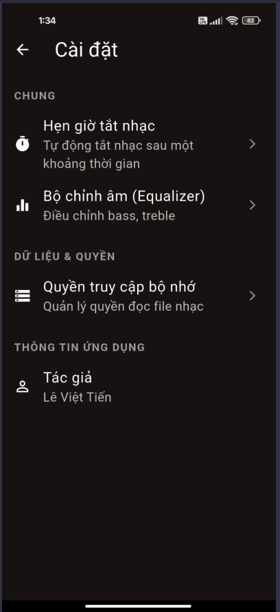
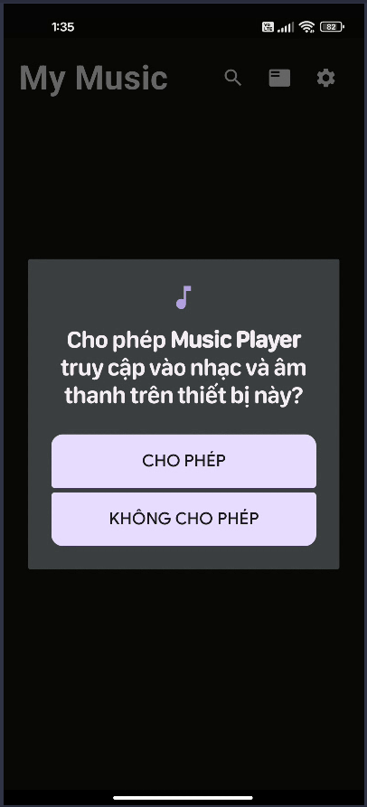
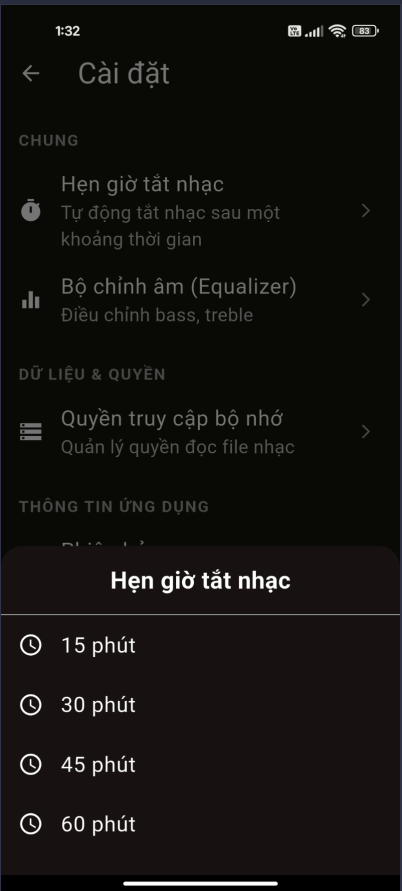

# Flutter Music Player - Offline Music Player App

## 📱 Giới thiệu

Ứng dụng nghe nhạc offline được xây dựng bằng Flutter, cho phép người dùng phát nhạc từ bộ nhớ thiết bị với giao diện đẹp mắt và nhiều tính năng tiện ích.

## ✨ Tính năng chính

### 🎵 Quản lý thư viện nhạc
- ✅ Tự động quét và hiển thị tất cả bài hát từ thiết bị
- ✅ Sắp xếp theo: Tên bài hát, Nghệ sĩ, Album, Ngày thêm
- ✅ Tìm kiếm bài hát theo tên, nghệ sĩ, album
- ✅ Lọc bài hát theo nghệ sĩ hoặc album
- ✅ Hiển thị metadata đầy đủ (tên bài, nghệ sĩ, album, thời lượng)
- ✅ Hiển thị ảnh bìa album

### 🎧 Điều khiển phát nhạc
- ✅ Play/Pause - Phát/Tạm dừng
- ✅ Next/Previous - Bài tiếp theo/Bài trước
- ✅ Seek - Tua đến vị trí bất kỳ
- ✅ Volume Control - Điều chỉnh âm lượng
- ✅ Background Playback - Phát nhạc nền (khi tắt màn hình)
- ✅ Progress Bar - Thanh tiến trình với hiển thị thời gian

### 🔀 Chế độ phát
- ✅ **Shuffle Mode** - Phát ngẫu nhiên
- ✅ **Repeat Modes**:
    - Off - Không lặp
    - All - Lặp tất cả bài hát
    - One - Lặp một bài hát

### 📝 Quản lý Playlist
- ✅ Tạo playlist mới
- ✅ Thêm/Xóa bài hát khỏi playlist
- ✅ Chỉnh sửa tên playlist
- ✅ Xóa playlist
- ✅ Danh sách "Recently Played" - Bài hát phát gần đây

### 💾 Lưu trữ & Persistence
- ✅ Lưu bài hát phát gần nhất
- ✅ Lưu vị trí phát khi thoát app
- ✅ Lưu tất cả playlists
- ✅ Lưu cài đặt shuffle/repeat
- ✅ Lưu mức âm lượng

### 🎨 Giao diện người dùng
- ✅ **Home Screen** - Màn hình chính với danh sách bài hát
- ✅ **Now Playing Screen** - Màn hình phát nhạc toàn màn hình
- ✅ **Mini Player** - Thanh phát nhỏ ở dưới cùng
- ✅ **Playlists Screen** - Quản lý playlists
- ✅ **Settings Screen** - Cài đặt ứng dụng
- ✅ Giao diện tối (Dark Theme) theo phong cách Spotify
- ✅ Animations mượt mà

## 🌟 Tính năng Bonus

### ⏰ Sleep Timer (Hẹn giờ tắt nhạc)
- ✅ Đặt thời gian tự động dừng phát nhạc
- ✅ Các tùy chọn thời gian: 5, 10, 15, 30, 45, 60 phút
- ✅ Tùy chọn tắt sau khi kết thúc bài hát hiện tại
- ✅ Hiển thị thời gian còn lại
- ✅ Fade out âm thanh trước khi dừng (giảm dần âm lượng)
- ✅ Hủy timer bất cứ lúc nào
- ✅ Thông báo khi timer sắp kết thúc

## 🛠️ Công nghệ sử dụng

### Framework & Language
- Flutter SDK
- Dart

### Packages chính
```yaml
dependencies:
  just_audio: ^0.9.36              # Phát nhạc
  audio_service: ^0.18.12          # Phát nhạc nền
  provider: ^6.1.1                 # State management
  shared_preferences: ^2.2.2       # Lưu trữ local
  path_provider: ^2.1.1            # Truy cập đường dẫn
  permission_handler: ^11.1.0      # Xin quyền truy cập
  on_audio_query: ^2.9.0           # Đọc thư viện nhạc
  audio_session: ^0.1.18           # Quản lý audio session
  rxdart: ^0.27.7                  # Reactive programming
```

## 📦 Cài đặt

### Yêu cầu hệ thống
- Flutter SDK >= 3.0.0
- Dart SDK >= 3.0.0
- Android Studio / VS Code
- Android SDK (cho Android)
- Xcode (cho iOS)

### Các bước cài đặt

1. **Clone repository**
```bash
git clone https://github.com/[username]/flutter_music_player_[your_name].git
cd flutter_music_player_[your_name]
```

2. **Cài đặt dependencies**
```bash
flutter pub get
```

3. **Cấu hình permissions**

**Android** - Đã được cấu hình sẵn trong `android/app/src/main/AndroidManifest.xml`:
- READ_EXTERNAL_STORAGE
- READ_MEDIA_AUDIO (Android 13+)
- WAKE_LOCK
- FOREGROUND_SERVICE

**iOS** - Đã được cấu hình sẵn trong `ios/Runner/Info.plist`:
- NSAppleMusicUsageDescription
- UIBackgroundModes (audio)

4. **Chạy ứng dụng**
```bash
# Chạy trên thiết bị/emulator đã kết nối
flutter run

# Hoặc build APK
flutter build apk --release
```

## 📱 Hướng dẫn sử dụng

### Lần đầu sử dụng
1. Mở ứng dụng
2. Cấp quyền truy cập bộ nhớ khi được yêu cầu
3. Ứng dụng sẽ tự động quét và hiển thị tất cả bài hát

### Phát nhạc
1. Chọn bài hát từ danh sách
2. Sử dụng các nút điều khiển:
    - ⏯️ Play/Pause
    - ⏭️ Next
    - ⏮️ Previous
    - 🔀 Shuffle
    - 🔁 Repeat

### Tạo Playlist
1. Vào màn hình Playlists
2. Nhấn nút "Create Playlist"
3. Nhập tên playlist
4. Thêm bài hát vào playlist

### Sử dụng Sleep Timer
1. Mở màn hình Now Playing
2. Nhấn vào biểu tượng menu (⋮)
3. Chọn "Sleep Timer"
4. Chọn thời gian mong muốn
5. Nhạc sẽ tự động dừng sau thời gian đã đặt

## 📸 record video
### Ghi lại hoạt động từng chức năng của ứng dụng
[](https://drive.google.com/file/d/1aEUJ0q9P44cqBwgxoI9L3pFCwSK9fyAa/view?usp=sharing)

## 📸 Screenshots

### Màn hình chính


### Màn hình Now Playing


### Mini Player


### Playlists


### Search


### Setting


### Permission request dialog


### Sleep Timer


## 🏗️ Cấu trúc dự án

```
lib/
├── main.dart                          # Entry point
├── models/                            # Data models
│   ├── song_model.dart
│   ├── playlist_model.dart
│   └── playback_state_model.dart
├── services/                          # Business logic
│   ├── audio_player_service.dart
│   ├── storage_service.dart
│   ├── permission_service.dart
│   └── playlist_service.dart
├── providers/                         # State management
│   ├── audio_provider.dart
│   ├── playlist_provider.dart
│   └── theme_provider.dart
├── screens/                           # UI screens
│   ├── home_screen.dart
│   ├── now_playing_screen.dart
│   ├── playlist_screen.dart
│   ├── all_songs_screen.dart
│   └── settings_screen.dart
├── widgets/                           # Reusable widgets
│   ├── song_tile.dart
│   ├── mini_player.dart
│   ├── player_controls.dart
│   ├── progress_bar.dart
│   ├── playlist_card.dart
│   ├── album_art.dart
│   └── sleep_timer_dialog.dart
└── utils/                             # Utilities
    ├── constants.dart
    ├── duration_formatter.dart
    └── color_extractor.dart
```

## 🎨 Thiết kế

### Color Palette
- **Primary**: #1DB954 (Spotify Green)
- **Secondary**: #191414 (Dark Background)
- **Accent**: #FFFFFF (White Text)
- **Card Background**: #282828

### Typography
- Font: Circular Std / Roboto
- Sizes: 12sp - 28sp

## ⚠️ Các hạn chế đã biết

1. **Định dạng audio**: Hỗ trợ MP3, M4A, WAV, FLAC, OGG
2. **Android 13+**: Cần quyền READ_MEDIA_AUDIO riêng biệt
3. **iOS**: Cần test thêm trên thiết bị thật
4. **Metadata**: Một số file có thể thiếu thông tin nghệ sĩ/album

## 🚀 Cải tiến trong tương lai

- [ ] Equalizer (Bộ chỉnh âm)
- [ ] Lyrics Display (Hiển thị lời bài hát)
- [ ] Audio Visualizer (Hiệu ứng hình ảnh theo nhạc)
- [ ] Dynamic Theme (Đổi màu theo album art)
- [ ] Crossfade (Chuyển bài mượt mà)
- [ ] Cloud Sync (Đồng bộ playlists)
- [ ] Share Functionality (Chia sẻ bài hát)
- [ ] Statistics (Thống kê nghe nhạc)

## 🧪 Testing

### Đã test
- ✅ Phát các định dạng audio khác nhau
- ✅ Phát nhạc nền
- ✅ Shuffle và Repeat modes
- ✅ Tạo và quản lý playlists
- ✅ Permissions handling
- ✅ Sleep timer functionality
- ✅ Lưu trữ và khôi phục state

### Thiết bị test
- Android 12 (Samsung Galaxy S21)
- Android 13 (Pixel 6)
- Emulator Android 11

## 🤝 Đóng góp

Mọi đóng góp đều được chào đón! Vui lòng:
1. Fork repository
2. Tạo branch mới (`git checkout -b feature/AmazingFeature`)
3. Commit changes (`git commit -m 'Add some AmazingFeature'`)
4. Push to branch (`git push origin feature/AmazingFeature`)
5. Mở Pull Request

## 📄 License

Dự án này được phát triển cho mục đích học tập.

## 👨‍💻 Tác giả

**Lê Việt Tiến**
- MSSV: 2224801030398
- Email: letien2081@gmail.com
- GitHub: [LeTien0811](https://github.com/LeTien0811)
- 
## 📞 Liên hệ

Nếu có bất kỳ câu hỏi hoặc góp ý nào, vui lòng liên hệ qua:
- Email: letien2081@gmail.com
- GitHub Issues: https://github.com/LeTien0811

---

**Note**: Ứng dụng này được phát triển như một bài tập học tập. Đảm bảo tuân thủ bản quyền khi sử dụng các file nhạc.